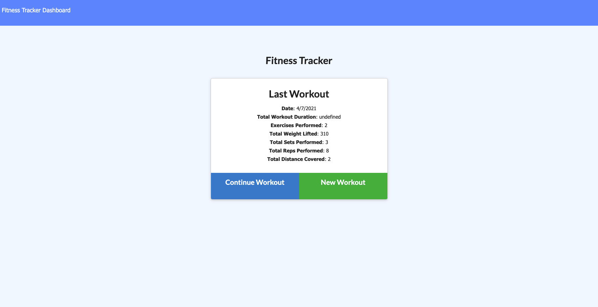

# workout-tracker

This Application is a fitness tracker that allows a user to create and track daily workouts. It provides graphics and visuals for the user to see what they have done in the past.  The User may choose between cardio and resistance add the exercise name, type, weight, reps, sets, and duration! 

Heroku Deployed Application [click here](https://serene-taiga-73545.herokuapp.com/)

